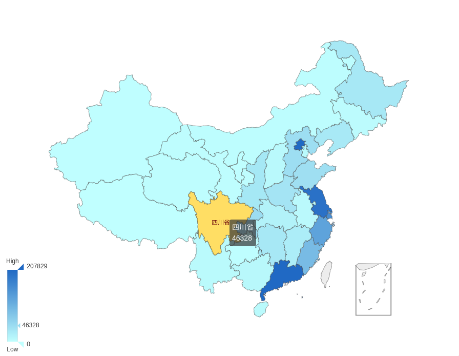

## 说明
该插件是基于[echarts](https://echarts.baidu.com/)开发的Grafana插件，现支持柱状图、折线图、地图、饼图
有些地方还不够完善，欢迎提出宝贵意见或建议。


## 安装
### 安装到全局插件目录
```
git clone https://github.com/virnet/echarts-panel.git
sudo service grafana-server restart
```


### 安装到自定义目录
如果你想把插件放到你自己的目录，可以在grafana.ini配置文件中追加如下语句
```ini
[plugin.echarts]
path = /home/your/clone/dir/echarts-panel
```

## 截图
### 柱状图


### 线图


### 地图


### 饼图


### 选项
