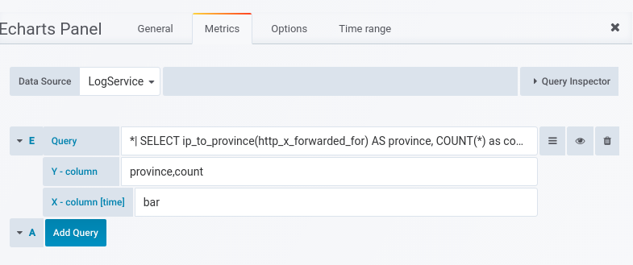
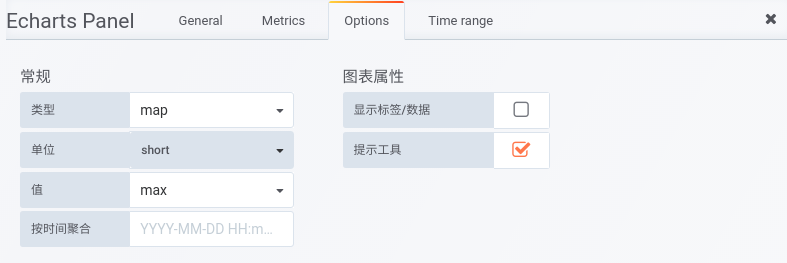
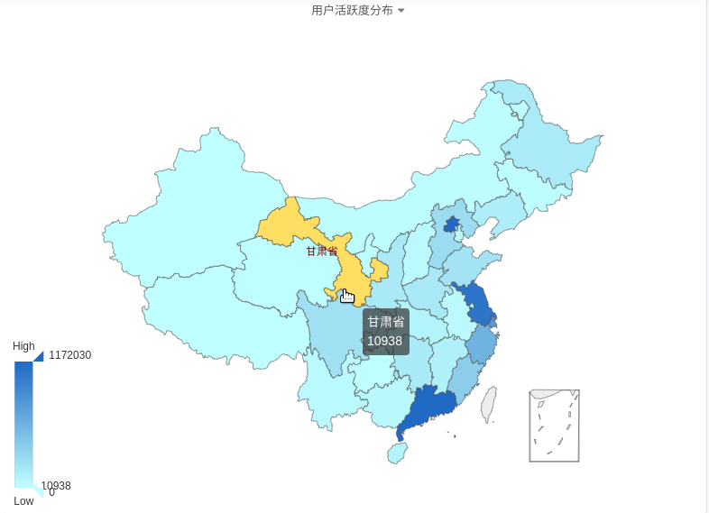

### 说明
- 当前只针对阿里云SLS服务的查询结果做过测试，其它数据源有待验证
- 当前只支持中国省级地图，后续会增加市级地图和世界级地图以及自定义(GroJSON)地图

## 数据接入
### 阿里云日志服务(SLS)
#### 原始数据
> `*| SELECT ip_to_province(http_x_forwarded_for) AS province, COUNT(*) as count where ip_to_country_code(http_x_forwarded_for)='CN'  GROUP BY province ORDER BY count DESC`

|province|count|
|--------|-----|
|广东省|1,452,961|
|北京市|1,151,899|
|江苏省|1,063,157|
|上海市|786,403|
|浙江省|568,344|
|福建省|374,550|
|河北省|258,528|
|四川省|233,715|
|重庆市|220,237|
|山东省|206,886|
|河南省|163,738|
|陕西省|163,197|
|湖南省|162,943|
|黑龙江省|156,080|
|辽宁省|129,582|
|江西省|109,567|
|海南省|95,271|
|湖北省|91,851|
|广西壮族自治区|52,310|
|云南省|39,969|
|山西省|39,872|
|天津市|36,493|
|安徽省|35,299|
|内蒙古自治区|18,707|
|吉林省|17,283|
|贵州省|11,402|
|甘肃省|10,748|
|青海省|8,010|
|宁夏回族自治区|4,771|
|新疆维吾尔自治区|3,437|
|西藏自治区|303|

#### 查询及选项配置

#### 效果
