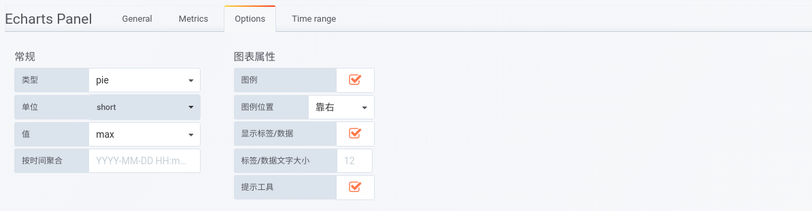

## 说明
当前版本饼图建议用table数据，时序数据优化不是很好，后续会增加对时序数据的优化。
name为单个饼图的系列，metric列为层次，最大可叠5层。

## 数据接入
### MySQL
#### 原始数据
> 注意列名别弄错了

> `SELECT name,item as metric,value FROM monitor.test where id>=10`

|name|metric|value|
|---|---|---|
|服务器|类型|253|
|数据库|类型|48|
|北京(Server)|区域|86|
|四川(Server)|区域|167|
|四川(DB)|区域|48|
|自用(BJ-Server)|用途|60|
|项目(BJ-Server)|用途|26|
|自用(SC-Server)|用途|93|
|项目(SC-Server)|用途|74|
|自用(SC-DB)|用途|48|

#### 查询及选项配置

#### 效果

